## Summary

This module is designed to quickly and efficiently answer questions such as "How far can I move this turn? What enemies can I reach in the fewest actions? How can I best navigate difficult terrain?" I wrote it because I (not to mention the rest of my group) was tired of my pulling out Rulers, Blasts, and other helpers to figure out "Can I do _this_? Hmm, no, but maybe if I do it _this_ way ... nope, that doesn't work either. What about ..."

## Basic Usage

Click  to toggle the Overlay on and off. Once the Overlay is enabled, it should Just Work™ with little to no interaction from you. By default, it assumes your weapon has a range of 5 feet; shift-click the button to change it for your currently selected token. Normally the overlay will reread your position at the end of your combat turn; control-click the button to force the Overlay to reposition. Display preferences are available in the module's Settings page.

## Compatibility
Maps: This module relies on square tiles; I have no idea what would happen if you tried to use it on a map with hex tiles, but I don't think it would go well.

Systems: My table plays Pathfinder 2E, and that's all I've tested it with.
It turns out that every system stores its token/actor move speeds in a different spot,
so out of the box speed autodetection will only work with Pathfinder 1, Pathfinder 2E, DND3.5,
and DND5E. If you're playing with a different system, you'll need to do some
[extra configuration](#advanced-setting-the-speed-attribute-path). Also, I believe other systems
treat diagonals differently, so there's a (GM-only) setting telling the module how to count
diagonal movement.

Modules: This module requires lib-wrapper and supports the Enhanced Terrain Layer.

## Understanding the Overlay

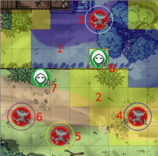

The overlay in this image assumes a movement speed of 15ft/action and a weapon range of 10ft.

1. Tiles tinted blue can be reached in a single action.  
2. Tiles tinted yellow can be reached in 2 actions.  
3. Enemies circled in white can be attacked without moving.  
4. Enemies circled in blue can be attacked in a single move.  
5. Enemies circled in yellow can be attacked with 2 moves.  
6. Enemies circled in red require 3 or more movements to attack.  
7. All tokens (other than the selected token) in combat are annotated with their initiative order relative to the current token.  
8. The selected token is annotated with the currently selected weapon range.  

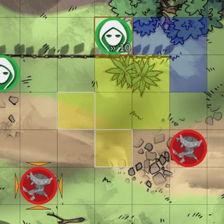

If a target is selected, tiles in your movement range _and_ in range of the target will be highlighted in white, and only tiles on the shortest path to the highlighted squares will remain tinted.  
If multiple targets are selected, only tiles in range of _all_ targeted enemies will be highlighted. If there's no way to hit all targeted enemies at once, the Overlay will display a warning and act as if no enemies are targeted.

## Sample Use-cases

The Overlay is useful no matter what kind of character you're playing as:

### Melee

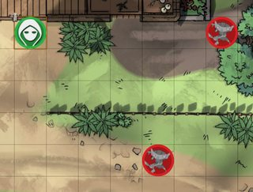
Suppose you're trying to decide between these two enemies.

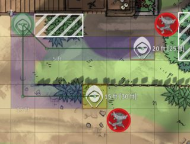
Both enemies are obstructed - one by difficult terrain, one by walls - so a straight ruler won't help you.

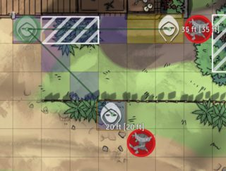
You'll need to use waypoints to get the true movement distances.

Or you can use the Overlay to instantly see how many movement actions it'll take to attack each enemy.

### Archery

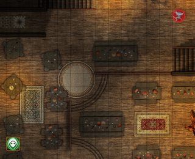
You want to attack this enemy, and you'd like to get _just_ close enough to attack him without his being able to close the distance and attack you on his turn.

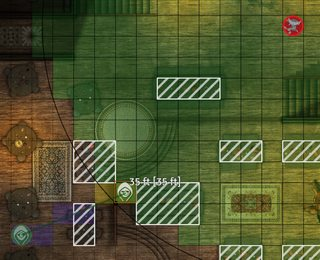
You drop a Blast on his position and then move to a tile on the very edge of the Blast (of course, working with Blasts takes a lot of control palette switching, clicking, dragging, deleting ... it's kind of a pain).

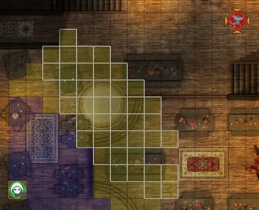
Or you can use the Overlay to see where you can move to that's inside your attack range and move to the position that's nearest you.

### Magic

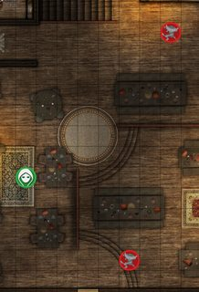
You want to cast Electric Arc (a 2 action, 2 target, 30ft range spell) on these two enemies. Where can you hit them both from? Are they close enough for you to hit them both? Can you reach a good spot in only one action so you'll have the two remaining actions to cast the spell?

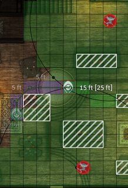
You could drop _two_ Blasts and then measure your distance to the overlapping tiles (with waypoints, of course - moving straight through that difficult terrain would be too much).

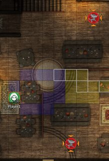
Or you can use the Overlay to see where you can attack them both from and how far away the good spots are.

### Tactician

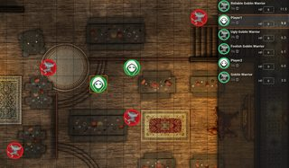
You're pretty sure you can kill any of these enemies on your turn, and you'd like to kill one that'll go before your teammate to reduce how many enemies there are to attack him (or you). Unfortunately, while the Combat Tracker shows initiative order it doesn't take positioning into account, and trying to figure out which entry in the Combat Tracker corresponds to combatant tokens can be a pain.

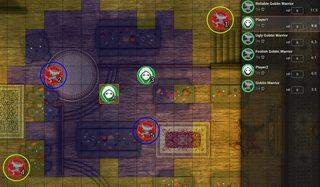
Or you can use the Overlay to see who's close to you _and_ going before your teammate.

## Advanced: Setting the speed attribute path
If you're using an unsupported System, you'll need to set the speed attribute path in 
the module settings. Here's how to do it:
1) Select a token
1) Open your browser's dev tools and switch to the Javascript console
1) Type in `canvas.tokens.controlled[0].actor.system` and press Enter
1) Expand the result, then keep expanding children until you find the movement speed. Take note of each child
you expand
    * For instance, with Pathfinder 2E, you expand `data`, `attributes`, `speed`, and find the speed in `total` 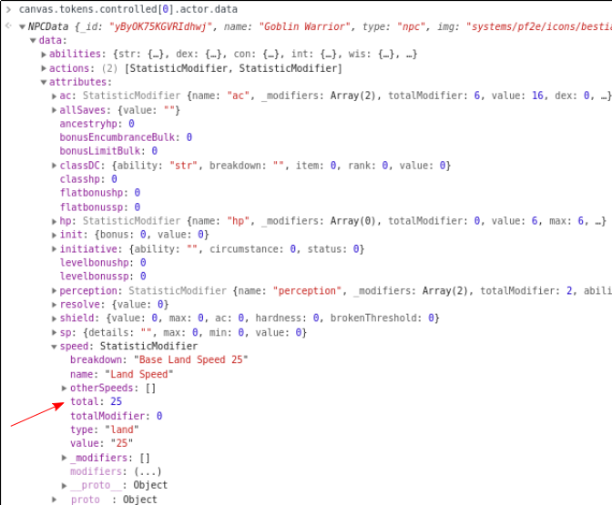
1) Join these names with periods to come up with your attribute path
    * For Pathfinder 2E, this would be `data.attributes.speed.total`